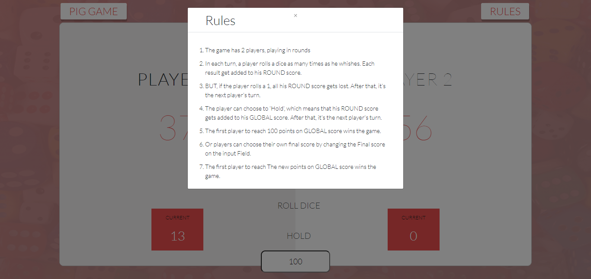
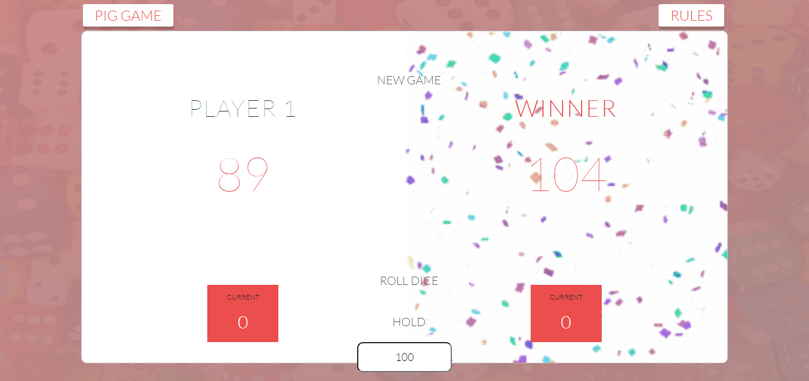
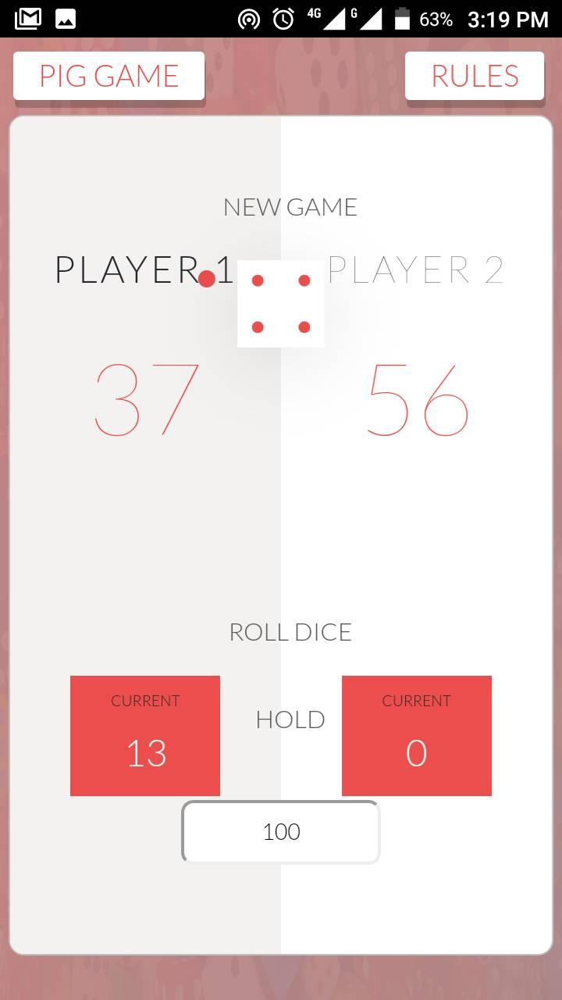

# Pig Game

## Welcome! 👋

Thanks for checking out this project!!!
Pig is a simple dice game first described in print by John Scarne in 1945.[1] As with many games of folk origin, Pig is played with many rule variations

You can also try the game out at (https://admiring-shirley-e32b17.netlify.app/)

## Technologies Used

- Reactjs
- JavaScript
- JSX
- CSS3
- SASS/SCSS
- Bootstrap
- Webpack
- npm

### Game Preview

Here is a simple overview of the game.

### Rules

Rules Modal overview

### Winning Score

The default winning Score is 100 but can choose a custom score by editing the Final score.

### Mobile View

You can play the Game on any device, its full responsive.

