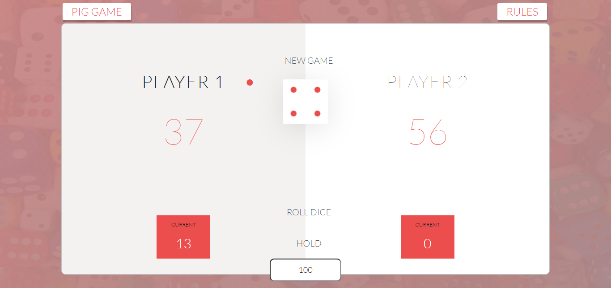

# Pig Game
>Pig is a simple dice game first described in print by John Scarne in 1945.[1] As with many games of folk origin, Pig is played with many rule variations. This project is built with react, and uses class components to manage state.

### Game Preview

Here is a simple overview of the game.

## Live Demo

You can also try the game out at [here](https://piggameonline.netlify.app/)

## Technologies Used

- Reactjs
- JavaScript
- CSS3
- SASS/SCSS
- Webpack
- npm

## Getting Started

**To use this project you need to clone the repository to your local machine, and open the folder then run index.html file which is the main file of the project.**

To get a local copy up and running follow these simple example steps.

### Prerequisites

To work on this project locally you need to have `Node.js` installed in your machine.

### Setup

To setup this project first you should have to clone the repository and the go to the projects directory and run `npm install` command to install the needed dependency. After that run `npm start` command to run the project from local server to `http://localhost:3000/`.

### Install

You have to have `Node.js` installed before working on this project.

### Usage

To start the dev server just run `npm start`.
You can work in your favorite Code Editor.

## Authors

👤 **Lusindiso Ntanjana**

- GitHub: [@Lusindiso](https://github.com/Lusindiso)
- Twitter: [@LusindisoNt](https://twitter.com/LusindisoNt)
- LinkedIn: [LinkedIn](https://www.linkedin.com/in/lusindisontanjana/)

## 🤝 Contributing

Contributions, issues, and feature requests are welcome!

Feel free to check the [issues page](../../issues/).

## Show your support

Give a ⭐️ if you like this project!
